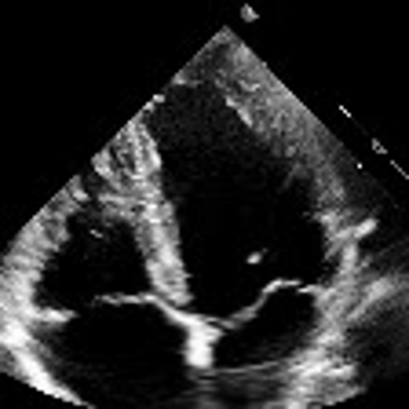

# Trans-UNet
Implementation of the latest state of the art segmentation model (TransUNet)

# Data
To assess performance, we will set our goal to the segmentation of the MV (mistral valve) in echocardiography videos.
<div style="display: flex; justify-content: center; gap: 20px;">
  

  
</div>

# Results
TBD

# Running

### Usage
```shell
$ python main.py --help                                                                               ─╯
usage: main.py [-h] [--preprocess] [--train]

CLI tool.

options:
  -h, --help    show this help message and exit
  --preprocess  Run preprocessing step.
  --train       Run training step.
```
### Download and Preprocessing Data
Download dataset from the following link: [dataset_train_test](https://drive.google.com/drive/folders/1DZBMwiqPEIhZa8o5H_A3l7V4IpV5HpYK?usp=sharing)

Place the files `test.pkl` and `train.pkl` in the `data_compressed/` folder

Then run the following command:

```shell
$ python main.py --preprocess
```
